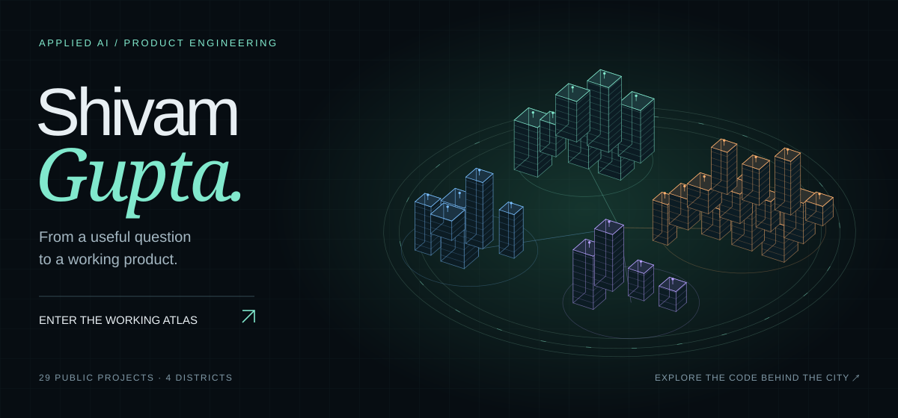

# Shivam Gupta

**Applied AI engineer · Product builder · Founder, Siloed**

I turn “someone should build this” into “try this link.”

I build AI products from the first customer conversation through architecture, implementation, evaluation and deployment. My work spans education, enterprise software and small experiments with a point of view. I care about useful products, clear interfaces and evidence that the system works.

[LinkedIn](https://www.linkedin.com/in/shivamgupta-ai/) · [Email](mailto:shivam.work.eml@gmail.com) · Dubai / Delhi

## Selected work

| Project | The problem it tackles | Engineering worth opening |
| :--- | :--- | :--- |
| **[RepoGauntlet](https://github.com/shi1720/repo-gauntlet)** | A coding benchmark needs trustworthy tests before it can judge an agent. | Python control plane; five language environments; broken, incomplete and golden controls; reproducible reports. |
| **[OfferLoop](https://github.com/shi1720/offerloop)** | Job applications disappear into spreadsheets and missed follow-ups. | FastAPI, React and Google Cloud; grounded AI drafts; retry-safe imports and scheduled reminders. |
| **[StepFree](https://github.com/shi1720/stepfree)** | Accessibility fixes need proof that they helped without damaging the page. | Agent-assisted repair, independent scans, content-integrity checks and a human review path. |
| **[Plot Twist](https://github.com/shi1720/plottwist)** | A personality quiz can be playful without hiding how it reached its answer. | TypeScript scoring, a Python reference implementation, privacy-conscious sharing and browser-generated cards. |
| **[Baggage Claim](https://baggage-claim-shi1720.sg127977958.chatgpt.site/)** | Travel recommendations leave out how a city actually felt. | Anonymous trip reports, a 3D globe, weekly reveals and a persistent database. Live app; source stays private. |

[Browse the public project index](docs/projects.md) for smaller tools, experiments and their status.

## Beyond the public repos

- **Khoros:** led AI and analytics engineering for the IRIS AI modernization, working across a team of five engineers and a designer.
- **2 Hour Learning:** helped build learning applications serving 5,000+ learners and co-developed Incept, a content-generation pipeline that saved $1M+ annually.
- **Siloed:** founded an AI product consultancy and delivered work for 10+ clients across finance, healthcare, SaaS and other industries.

These are contributions to professional teams and client projects. Their implementation remains private.

## How I work

Start with the user's problem. Make a small version work. Measure failure cases. Improve the architecture where the evidence calls for it. Document the decisions someone else will have to live with.

My usual tools are **Python, TypeScript, FastAPI, React, PostgreSQL and Google Cloud**, with LLM APIs and evaluation harnesses where they earn their place. I use AI-assisted development and take responsibility for the result.

Outside work, I travel, follow interesting detours and occasionally turn them into another project.
