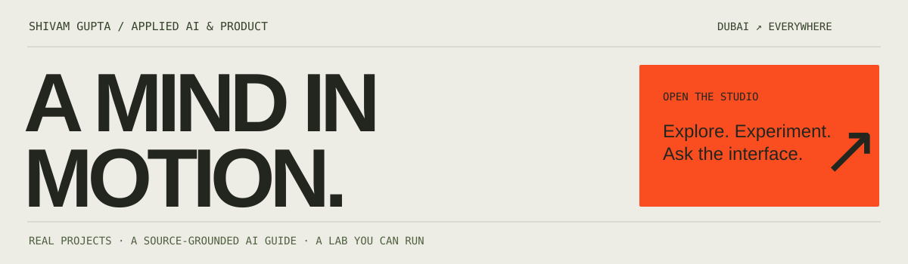

  <a href="https://shivamgupta.web.app"><strong>Enter the studio ↗</strong></a> &nbsp; · &nbsp;
  <a href="https://shivamgupta.web.app/#work">Explore the work</a> &nbsp; · &nbsp;
  <a href="https://shivamgupta.web.app/#lab">Run the agent lab</a> &nbsp; · &nbsp;
  <a href="https://www.linkedin.com/in/shivamgupta-ai/">LinkedIn</a> &nbsp; · &nbsp;
  <a href="mailto:shivam1720406@gmail.com">Email</a>

### I build the product. And the evidence that it works.

I'm **Shivam**, an applied AI engineer, product builder, and founder of **Siloed**. I work from the first customer conversation through architecture, implementation, evaluation, and deployment.

A recurring question in my work: **what happens when the happy path ends?** An agent retries a payment. A clinic can't match a recalled lot. A browser loses the response after saving. Those edges are often where the useful engineering begins.

The **[studio](https://shivamgupta.web.app)** lets you explore a folded 3D map of my projects, ask a source-grounded AI guide about the work, and run a local agent-reliability experiment. The Python export reproduces what the browser shows.

An earlier creative-coding experiment, the **[Working Atlas](https://shi1720.github.io/shi1720/)**, remains available: an interactive city generated from the same public project collection. [How it works →](atlas/README.md)

### A few places to start

| If you're interested in… | Open this | What to look for |
| :--- | :--- | :--- |
| **Trustworthy agent evaluation** | [RepoGym](https://github.com/shi1720/repogym) · [RepoGauntlet](https://github.com/shi1720/repo-gauntlet) | Executable repository tasks, broken and golden controls, reproducible evaluation. |
| **Finding the smallest failure** | [Casecrop](https://github.com/shi1720/casecrop) | Reduce an event trace while preserving dependencies and the same failure. |
| **Agents under pressure** | [Toolstorm](https://github.com/shi1720/toolstorm) | Deterministic tool failures, side-effect contracts, strict offline replay. |
| **Useful voice workflows** | [Benchback](https://github.com/shi1720/AssemblyAI) · [OffHire](https://github.com/shi1720/OffHire) | Parts-core returns and equipment closeouts, with transcript-grounded evidence. |
| **Software with a human point of view** | [Unpause](https://github.com/shi1720/RevenueCat-Shipaton) · [Plot Twist](https://github.com/shi1720/plottwist) | Resume an unfinished creative project, or meet a personality quiz that shows its working. |
| **Repair you can inspect** | [StepFree](https://github.com/shi1720/stepfree) | Accessibility fixes with independent scans, content-integrity checks, and review. |

**Also worth a look:** [Mixed Signals](https://github.com/shi1720/mixed-signals) maps anonymous experiences onto a globe. [OfferLoop](https://github.com/shi1720/OfferLoop-Job-CRM) makes the work between job applications visible. [KindHandoff Guard](https://github.com/shi1720/kindhandoff-guard) packages explicit handoff acceptance into a small TypeScript library.

### Work beyond the public repositories

**Khoros** — Led AI and analytics engineering for the IRIS AI modernization, working with five engineers and a designer.

**2 Hour Learning** — Helped build applications serving 5,000+ learners and co-developed Incept, a content-generation pipeline that saved $1M+ annually.

**Siloed** — Founded an AI product consultancy and delivered work for 10+ clients across finance, healthcare, SaaS, and other industries.

These are contributions to professional teams and client projects; their implementations remain private.

### Build with me

I’m open to **applied AI and product engineering roles**, remote work and relocation. Through **Siloed**, I help teams design and ship AI products, operational agents, internal tools, evaluation systems, and AI adoption programs.

[Discuss a role or a project →](https://shivamgupta.web.app/#contact)

### The tools follow the problem

Python · TypeScript · React · FastAPI · PostgreSQL · Google Cloud · evaluation harnesses · LLM APIs

I use AI-assisted development and take responsibility for the result. Start small, exercise the failure cases, and document what the next person needs to know.

---

Dubai / Delhi · Interested in difficult, useful problems. <a href="mailto:shivam1720406@gmail.com">Let's talk.</a> The studio and atlas are September 2026 snapshots of public work. Repository READMEs describe each project's scope, setup, and limitations.

